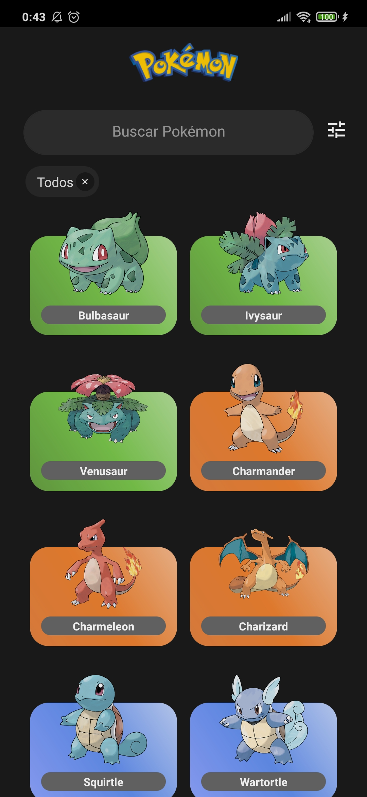
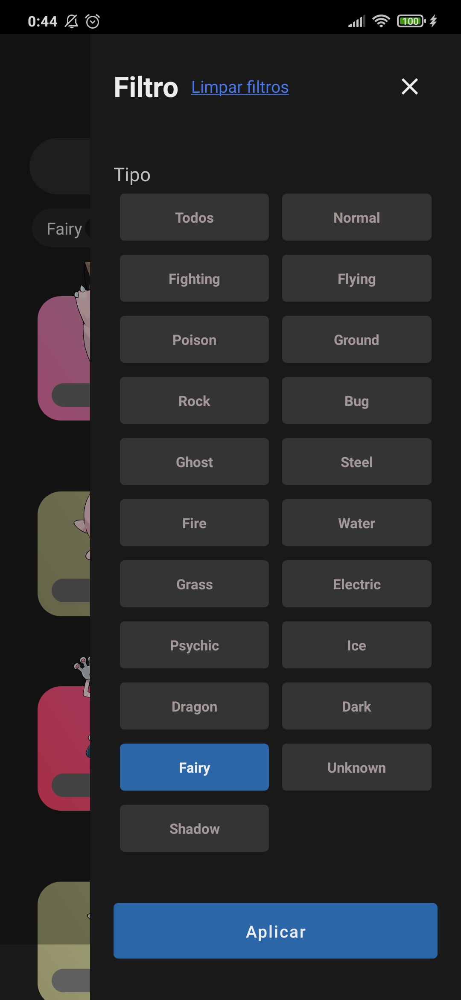
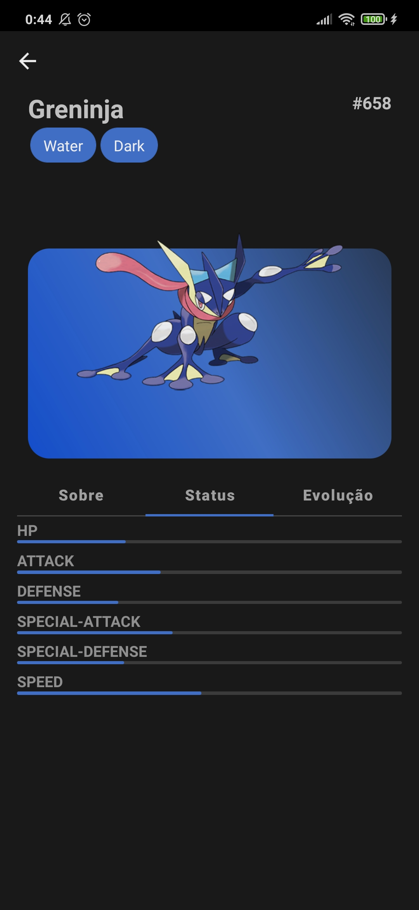
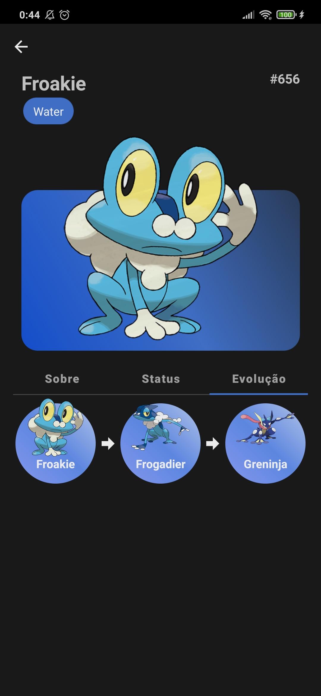

# Pokédex

A pokédex built with React Native using the pokéAPI

## Screenshots

|                                 |                                     |                                     |                                           |
| ------------------------------- | ----------------------------------- | ----------------------------------- | ----------------------------------------- |
|  |  |  |  |

# How to use

- Download the latest version (only android) in the [releases page](https://github.com/Bryant-Anjos/mobix-pokedex/releases)
- Install the APK in an Android phone (it needs to enable [third-party installations](https://www.androidauthority.com/how-to-install-apks-31494/))

If the version has a login page log with the following user:

| Email             | Password |
| ----------------- | -------- |
| `teste@email.com` | `123456` |

# For devs (Instructions to install and run)

## Prerequisites

- [git](https://git-scm.com/)
- [yarn](https://classic.yarnpkg.com/lang/en/)
- [node.js](https://nodejs.org/en/) (recommended v14.17.6)
- A mobile phone plugged to your computer using a USB cable or a Virtual Device created with Android Studio.

## Installation

- [Set up your react native environment](https://reactnative.dev/docs/environment-setup)
- Clone this repo:

```shell
git clone https://github.com/Bryant-Anjos/mobix-pokedex.git
```

- Enter in the repo directory:

```shell
cd mobix-pokedex
```

- Install the dependencies:

```shell
yarn install
```

## Execute

- In a terminal run:

```shell
yarn start
```

- In other:

```shell
yarn android
```
